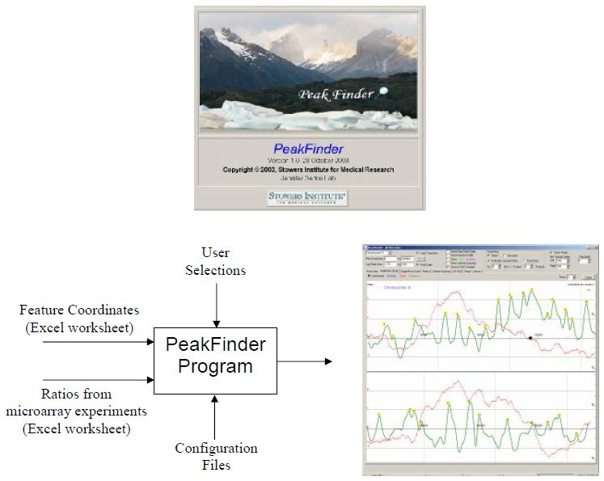
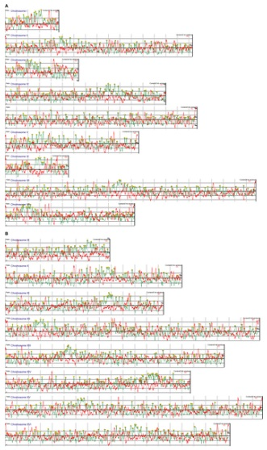

PeakFinder
==========

Supplementary material for [Genome-wide mapping of the cohesin complex in the yeast Saccharomyces cerevisiae](http://www.plosbiology.org/article/info%3Adoi%2F10.1371%2Fjournal.pbio.0020259) including Delphi source code for *PeakFinder* program.  The paper can also be found at [PubMed Central](http://www.ncbi.nlm.nih.gov/pmc/articles/PMC490026/).

Browse the **[Quick Start Guide](http://htmlpreview.github.io/?https://github.com/EarlGlynn/PeakFinder/blob/master/PeakFinderQuickStart.pdf)** or the complete **[Users Guide](http://htmlpreview.github.io/?https://github.com/EarlGlynn/PeakFinder/blob/master/PeakFinderUsersGuide.pdf)**.

The *[PeakFinder Program page](http://research.stowers-institute.org/gertonlab/peakfinder/index.html)* at Stowers Institute has several stale links.

This repository has fixes for the stale links:  Paper, Paper Figures, and Supplemental Data.  Find that information in the **webpage directory** in this repository.

The Delphi source was not included on the *PeakFinder Program* page when first published.  Find the source files here in the **Delphi-Source directory**.

The Delphi program used components unique to .xls Excel files, so it no longer works with the latest Microsoft Windows/Office installations. I designed the program to read the .xls files directly, so no human interaction was needed to modify the files recorded in the lab.  However, the program would still work today if I had required .CSV files for inputs instead of using Excel.

.

.

